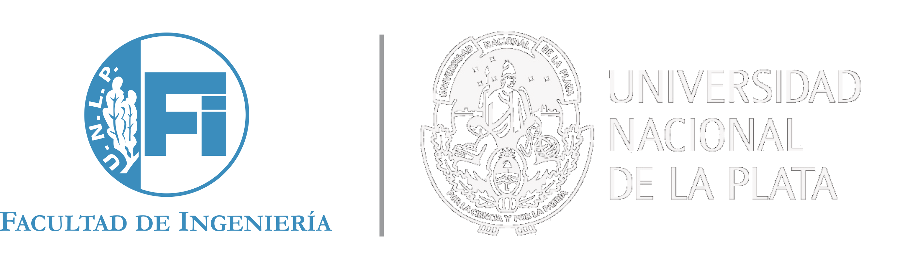

  
  

  

Andino is a fully open-source diff drive robot designed for educational purposes and low-cost applications.
It is fully integrated with ROS 2 and it is a great base platform to improve skills over the robotics field.
With its open-source design, anyone can modify and customize the robot to suit their specific needs.

  
  

This is a fork from the [Andino Project](https://github.com/Ekumen-OS/andino/tree/humble) from Ekumen-OS.
This fork was made with the porpouse of adapting the project to be run with 3D printed encoder disks and a 
Raspberry Pi 5 for the [Engineering College of National University of La Plata](https://ing.unlp.edu.ar/) 
who implemented this project with students of Robotics Introduction class.

### Implementation Teams

#### 2024

   Calvo, Matias. [LinkedIn](https://www.linkedin.com/in/calvomatias)
   Petrigh, Lautaro. [LinkedIn](https://www.linkedin.com/in/lautaro-petrigh-3876b7232)

  

